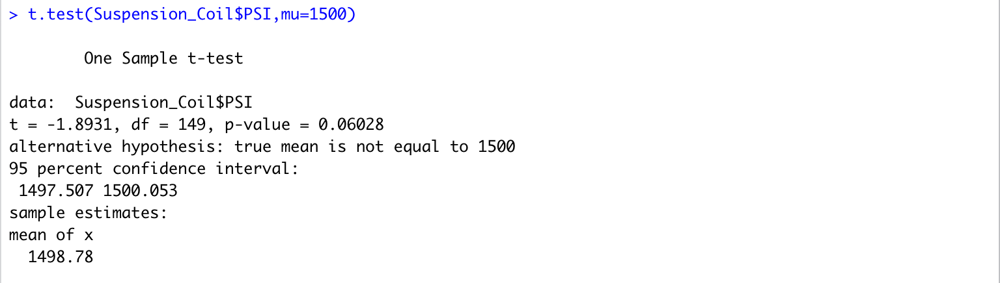

# MechaCar_Statistical_Analysis

## Linear Regression to Predict MPG

**1.	Which variables/coefficients provided a non-random amount of variance to the mpg values in the dataset?**

As can be determined by the t-value the Vehicle Weight, spoiler_angle and AWD provide a non-random amount of variance to the mpg values. Whereas, the           variables with the least non-random amount of variance are vehicle_length and ground_clearance. 
    
**2.	Is the slope of the linear model considered to be zero? Why or why not?**

The slope of the linear model would not be considered zero, this is due to the specified p-value being less than 0.05. 
    
**3.	Does this linear model predict mpg of MechaCar prototypes effectively? Why or why not?**

The provided linear model indicates an r-squared value of 71%; R-squared values indicate the percentage difference between the independent and dependent         variables in the dataset. Therefore, we can determine that approximately 71% of the time the linear model will predict the mpg values effectively, the remaining     29% could be due to instrumental error and/or external factors.  

## Summary Statistics on Suspension Coils

**The design specifications for the MechaCar suspension coils dictate that the variance of the suspension coils must not exceed 100 pounds per square inch. Does the current manufacturing data meet this design specification for all manufacturing lots in total and each lot individually? Why or why not?**

From the statistical data provided in the lot_summary the current manufacturing data in lots 1 and 2 do meet the designated design specifications, as both lots maintain a relatively similar mean and median which respectively also do not exceed the variance specification. Whereas, lot 3 exhibits the most incremental variance in which exceeds the design and manufacturing specifications. 

## T-Tests on Suspension Coils
While both lot 1 and 2 maintain values that do not vary substantially from the population mean, lot 3 has as p-value of 0.042. This indicates that there is evidence which supports that the PSI is slightly statistically different from the population mean of 1500 pounds per square inch. 

 ### T-test Results: 
 
 
 
 
 
